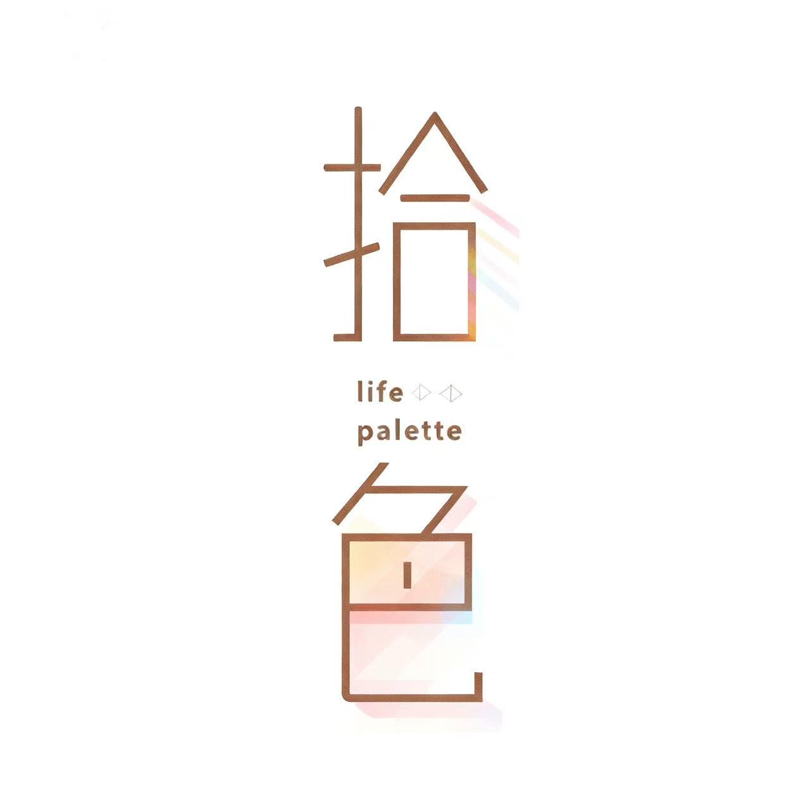

# Life-Palette 拾色

**Record your memories and craft your own masterpiece of life**

**以色彩为笔，以轨迹为墨，绘制专属于你的人生画卷**

---

## 关于我们

生活是一幅画，而你是唯一的画师。

**拾色 (Life-Palette)** 是一个致力于帮助用户记录生活色彩与足迹的开源项目组织。我们相信每一张照片都有它独特的色彩故事，每一个地点都承载着特别的回忆——拾色帮你把这些碎片编织成一幅完整的人生画卷。

> _"当你回顾自己的照片库，看到的不再只是图片，而是一场穿越时光的色彩之旅。"_

---

## 核心项目

| 项目 | 描述 | 技术栈 |
|------|------|--------|
| [LifePalette-Web](https://github.com/Life-Palette/LifePalette-Web) | Web 端应用 | React · TypeScript · Vite · TailwindCSS |

---

## 产品特色

🎨 **颜色画廊** — 智能提色、色彩轮盘、按色浏览

📝 **话题动态** — 富文本编辑、多媒体融合、社交互动

🗺️ **地图轨迹** — 自动定位、智能聚合、海报导出

🤖 **AI 助手** — 智能续写、文本润色、灵感激发

👤 **个人空间** — 个性定制、数据统计、扫码登录

---

## 使用场景

- **环游世界** — 照片自动标记地点，生成专属旅行足迹图
- **日常点滴** — 美食、风景、心情，配上文字就是一篇微日记
- **年度回顾** — 按颜色浏览，发现这一年的主色调
- **成长记录** — 统计数据可视化，见证自己的创作历程

---

## 联系我们

- 🌐 官网：[lpalette.cn](https://lpalette.cn)
- 📧 邮箱：3128006406@qq.com
- 📍 地区：China

---

## License

MIT License © 2025 Life-Palette

---

  Made with ❤️ by the Life-Palette Team

